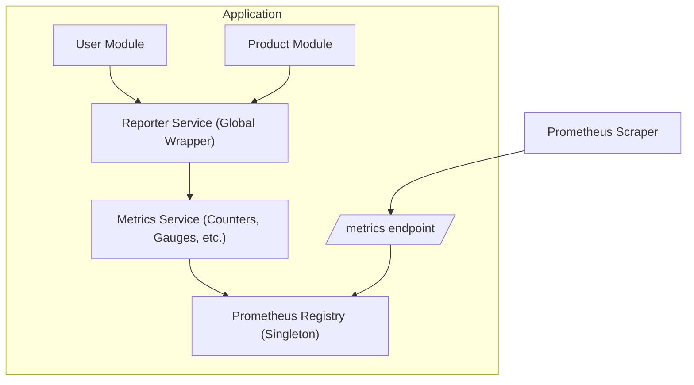

<p align="center">
  <a href="https://nestjs.com/" target="blank"></a>
</p>
<div align="center">
<h1 style="font-size: 2em;">NestJS Metrics Reporter</h1>

[](https://badge.fury.io/js/nestjs-metrics-reporter)
<a href="https://www.npmjs.com/package/nestjs-metrics-reporter" target="_blank"></a>
<a href="https://medium.com/elementor-engineers/avoid-prometheus-mess-in-nestjs-1ea368e3e21e" target="_blank"></a>
[](https://opensource.org/licenses/Apache-2.0)

📊 A **zero-dependency-injection** alternative to Prometheus metrics solutions for NestJS.  
Effortlessly report metrics from anywhere in your codebase without complex setup or dependency injection.

[Overview](#overview) •
[Quick Start](#quick-start) •
[API Reference](#api-reference) •
[Contributing](#contributing) •
[License](#license)

</div>

## Installation

```bash
npm install nestjs-metrics-reporter
```

---

## Overview

`nestjs-metrics-reporter` is a lightweight, **zero-setup** solution for reporting metrics in your NestJS application.
It eliminates the need for dependency injection or extensive configuration. Instantly report metrics from anywhere in 
your application using a global static reporter.

```typescript
import { ReporterService } from 'nestjs-metrics-reporter';

ReporterService.counter( 'api_requests_total', { endpoint: '/users' } );
```


---

## Why Choose `nestjs-metrics-reporter`?

🚀 **No Dependency Injection**  
No need for cumbersome dependency injection, making your code much more cleaner.

🌟 **Effortless Integration**  
Start tracking metrics immediately with zero setup.

🎯 **Focus on Simplicity**  
Powerful metrics without the complexity of managing dependencies or boilerplate code.

📤 **Pushgateway Support**  
Easily push metrics to a Pushgateway server for batch job metrics.

---

## Quick Start

### 1. Import and Configure the Module

Minimal setup required! Just import the `ReporterModule` in your `AppModule`.

```typescript
import { Module } from "@nestjs/common";
import { ReporterModule } from 'nestjs-metrics-reporter';

@Module( {
     imports: [
          ReporterModule.forRoot( {
               // Default metrics are disabled by default, set to true to enable.
               defaultMetricsEnabled: true,
               defaultLabels: {
                    app: 'my-app',
                    environment: 'production',
               },
               
               // Optional: Configure interceptors for custom metrics
               interceptors: [ SomeInterceptor ],
               
               // Optional: Configure Pushgateway for batch job metrics
               pushgatewayUrl: 'http://pushgateway:9091',
               pushgatewayOptions: {
                    timeout: 5000,
                    headers: {
                         'Custom-Header': 'value'
                    },
                    auth: {
                         username: 'user',
                         password: 'pass'
                    }
               }
          } ),
     ],
} )
export class AppModule {
}
```

### 2. Report Metrics Anywhere

Once initialized, you can start reporting metrics instantly from anywhere in your application.

```typescript
import { Injectable } from '@nestjs/common';
import { ReporterService } from 'nestjs-metrics-reporter';

@Injectable()
export class UserService {
     async createUser() {
          // Increment user creation counter
          ReporterService.counter( 'users_created_total', {
               source: 'api',
               user_type: 'standard'
          } );
          
          // Increment counter with custom value
          ReporterService.counter( 'batch_users_created_total', {
               source: 'batch',
               user_type: 'standard'
          }, 5 );
          
          // Update active user gauge
          ReporterService.gauge( 'active_users', 42, {
               region: 'us-east-1'
          } );
          
          // Push metrics to Pushgateway
          await ReporterService.pushMetrics( 'user_service_job' );
     }
}
```

---

## API Reference

The global static service for reporting metrics:

| Method          | Description                 | Parameters                                                  |
|-----------------|-----------------------------|-------------------------------------------------------------|
| `counter()`     | Increment a counter metric  | `key: string, labels?: Record<string, string \| number>, value?: number = 1`                          
| `gauge()`       | Set a gauge value           | `key: string, value: number, labels?: Record<string, string \| number>`           
| `histogram()`   | Record a histogram value    | `key: string, value: number, labels?: Record<string, string \| number>, buckets?: number[]` 
| `summary()`     | Record a summary value      | `key: string, value: number, labels?: Record<string, string \| number>, percentiles?: number[]`
| `pushMetrics()` | Push metrics to Pushgateway | `jobName: string`                                           |

### Module Configuration

#### `ReporterModule.forRoot(options)`

| Option                  | Type                     | Default     | Description                                 |
|-------------------------|--------------------------|-------------|---------------------------------------------|
| `defaultMetricsEnabled` | `boolean`                | `false`     | Enable collection of default metrics        |
| `defaultLabels`         | `Record<string, string>` | `{}`        | Labels automatically added to all metrics   |
| `pushgatewayUrl`        | `string`                 | `undefined` | URL of the Pushgateway server               |
| `pushgatewayOptions`    | `PushgatewayOptions`     | `{}`        | Additional options for Pushgateway requests |
| `interceptors`          | `Type<any>[]`            | `[]`        | Interceptors for custom metrics reporting   |

#### `ReporterModule.forRootAsync(options)`

Supports dynamic configuration with factory providers:

```typescript
ReporterModule.forRootAsync( {
     imports: [ ConfigModule ],
     inject: [ ConfigService ],
     useFactory: () => ( {
          defaultLabels: {
               app: configService.get( 'APP_NAME' ) || 'default-app',
               environment: configService.get( 'NODE_ENV' ) || 'development',
          },
          pushgatewayUrl: configService.get( 'PUSHGATEWAY_URL' ),
          pushgatewayOptions: {
               timeout: +configService.get( 'PUSHGATEWAY_TIMEOUT' ) || 5000
          }
     } ),
} );
```

---

## Release

This package uses semantic versioning via commit messages:

### Version Bumping Commits

```bash
# Patch Release (1.0.X)
fix: message      # Bug fixes
perf: message     # Performance improvements

# Minor Release (1.X.0)
feat: message     # New features

# Major Release (X.0.0)
feat!: message            # Breaking change
fix!: message             # Breaking change
BREAKING CHANGE: message  # Breaking change anywhere in the commit body
```

### Non-Version Bumping Commits

Only these specific types are allowed:

```bash
build: message    # Changes to build system or dependencies
chore: message    # Maintenance tasks
ci: message       # CI configuration files and scripts
docs: message     # Documentation only
refactor: message # Neither fixes a bug nor adds a feature
style: message    # Code style (formatting, semicolons, etc)
test: message     # Adding or correcting tests
```

Any other prefix will cause the commit to be ignored by semantic-release and won't appear anywhere in release notes.

---

## Contributing

Contributions are welcome! Please check out our [Contributing Guide](CONTRIBUTING.md) to get started.

---

## License

This project is licensed under the Apache License, Version 2.0 - see the [LICENSE](LICENSE) file for details.

---